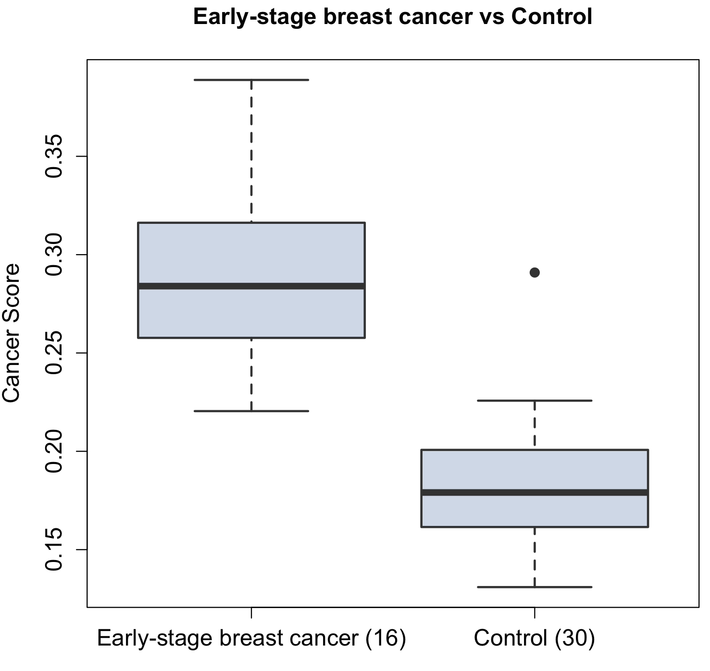

# DeepCAT
Deep Learning Method to Identify Cancer Associated TCRs

DeepCAT is a computational method based on convolutional neural network to exclusively identify cancer-associated beta chain TCR hypervariable CDR3 sequences. The input data were generated from tumor RNA-seq data and TCR repertoire sequencing data of healthy donors. Users do not need to perform training or evaluation. Instead, users can directly apply the PredictCancer function in the package, after downloading the CHKP folder. 
Standard pipeline of using DeepCAT:


 1. Clone github repository on your own machine in a desired folder

&nbsp; &nbsp; &nbsp;&nbsp;
    In Terminal:

```console
  git clone https://github.com/s175573/DeepCAT.git
```

 2. Go to DeepCAT folder and unzip DeepCAT_CHKP.zip file with pre-trained model 
   
```console
  cd DeepCAT
  unzip DeepCAT_CHKP.zip 
```

 3. Running the DeepCAT requires python3, biopython, tensorflow version 1.4 and matplotlib packages to be installed. If they are not installed on your machine, please run the command:
 
```console
  pip install python3 biopython tensorflow==1.14 matplotlib 
```

 4. Now we are ready to run DeepCAT to perform cancer score prediction  


***&nbsp; &nbsp; 4A. User doesn't have raw TCR repertoire sequencing data.***
 


&nbsp; &nbsp; &nbsp;&nbsp;
In this case please use the data in a SampleData folder for an example input. 
This folder contains 4 files, all profiled by Adaptive Biotechnology and can be downloaded from immuneAccess (https://clients.adaptivebiotech.com/immuneaccess).

&nbsp; &nbsp; &nbsp;&nbsp;
Files 1 and 2 come from early-stage breast cancer patients; 3 and 4 from healthy donors.<br />
To process input files just call Script_DeepCAT.sh:

```console
  bash  Script_DeepCAT.sh -t SampleData
```

&nbsp; &nbsp; &nbsp;&nbsp;
DeepCAT will output Cancer_score.txt file. 


```console
  $ cat Cancer_score.txt
  sample1.tsv_ClusteredCDR3s_7.5.txt	0.31860474
  sample2.tsv_ClusteredCDR3s_7.5.txt	0.22043602
  sample3.tsv_ClusteredCDR3s_7.5.txt	0.17322193
  sample4.tsv_ClusteredCDR3s_7.5.txt	0.17117158
```

&nbsp; &nbsp; &nbsp;&nbsp; 
where first column contains name of the input file, second column is mean cancer score for all sequences in corresponding input file.<br />

&nbsp; &nbsp; &nbsp;&nbsp;
Let’s make boxplots with cancer score for early-stage breast cancer patients (sample1 and sample2) and healthy donors (sample3 and sample4).

<p align="center">
  
</p>


***&nbsp; &nbsp; 4B. User has raw TCR repertoire sequencing data.***


&nbsp; &nbsp; &nbsp;&nbsp;
If starting from raw TCR repertoire sequencing data produced from AdaptiveBiotech immuneAnalyzer, please create a folder (your_folder_name) in a DeepCAT directory and place your input “tsv” file/s there. The DeepCAT directory contains example of raw input file, Example_raw_file.tsv.

```console
  mkdir your_folder_name
  bash  Script_DeepCAT.sh -r your_folder_name
```

&nbsp; &nbsp; &nbsp;&nbsp;
After running Script_DeepCAT.sh an output file Cancer_score.txt will be created, which contains name of the input file and corresponding cancer score. 

## Training of DeepCAT models

