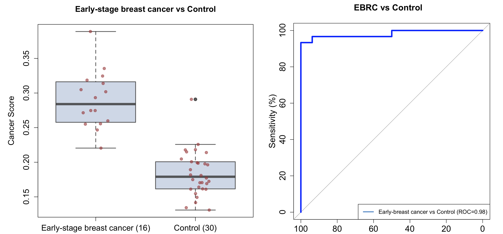

# DeepCAT 

### Deep CNN Model for Cancer Associated TCRs

DeepCAT is a computational method based on convolutional neural network to exclusively identify cancer-associated beta chain TCR hypervariable CDR3 sequences. The input data were generated from tumor RNA-seq data and TCR repertoire sequencing data of healthy donors. Users do not need to perform training or evaluation. Instead, users can directly apply the PredictCancer function in the package, after downloading the CHKP folder. 

### Standard pipeline of using DeepCAT


 1. Clone github repository on your own machine in a desired folder

&nbsp; &nbsp; &nbsp;&nbsp;
    In Terminal:

```bash
  git clone https://github.com/s175573/DeepCAT.git
```

 2. Go to DeepCAT folder and unzip DeepCAT_CHKP.zip file with pre-trained model 
   
```bash
  cd DeepCAT
  unzip DeepCAT_CHKP.zip 
```

 3. Running the DeepCAT requires python3, biopython, tensorflow version 1.4 and matplotlib packages to be installed. If they are not installed on your machine, please run the command:
 
```bash
  pip install biopython tensorflow==1.14 matplotlib scikit-learn
```

 4. Now we are ready to run DeepCAT to perform cancer score prediction  


***&nbsp; &nbsp; 4A. User doesn't have raw TCR repertoire sequencing data.***
 


&nbsp; &nbsp; &nbsp;&nbsp;
In this case please use the data in a SampleData folder for an example input. 
This folder contains 4 files, all profiled by Adaptive Biotechnology and can be downloaded from immuneAccess (https://clients.adaptivebiotech.com/immuneaccess).

&nbsp; &nbsp; &nbsp;&nbsp;
Files 1 and 2 come from early-stage breast cancer patients; 3 and 4 from healthy donors.<br />
To process input files just call Script_DeepCAT.sh:

```bash
  bash  Script_DeepCAT.sh -t SampleData/Control
  bash  Script_DeepCAT.sh -t SampleData/Cancer
```

&nbsp; &nbsp; &nbsp;&nbsp;
DeepCAT will output two files, Cancer_score_Control.txt and Cancer_score_Cancer.txt. 


```bash
  $ head Cancer_score_Control.txt
  TestReal-HIP09051.tsv_ClusteredCDR3s_7.5.txt	0.22574785
  TestReal-HIP09559.tsv_ClusteredCDR3s_7.5.txt	0.16407683
  TestReal-HIP09364.tsv_ClusteredCDR3s_7.5.txt	0.21816333
  TestReal-HIP09062.tsv_ClusteredCDR3s_7.5.txt	0.17059885
  TestReal-HIP09190.tsv_ClusteredCDR3s_7.5.txt	0.17043449
  TestReal-HIP09022.tsv_ClusteredCDR3s_7.5.txt	0.16097252
  TestReal-HIP09029.tsv_ClusteredCDR3s_7.5.txt	0.172395
  TestReal-HIP09159.tsv_ClusteredCDR3s_7.5.txt	0.17491624
  TestReal-HIP09775.tsv_ClusteredCDR3s_7.5.txt	0.21496484
  TestReal-HIP10377.tsv_ClusteredCDR3s_7.5.txt	0.19861585
```

&nbsp; &nbsp; &nbsp;&nbsp; 
where first column contains name of the input file, second column is mean cancer score for all sequences in corresponding input file.<br />

&nbsp; &nbsp; &nbsp;&nbsp;
Let’s make boxplots with cancer scores and ROC curve for early-stage breast cancer patients (16 samples) and healthy donors (30 samples).

<p float="left">
  
</p>


***&nbsp; &nbsp; 4B. User has raw TCR repertoire sequencing data.***


&nbsp; &nbsp; &nbsp;&nbsp;
If starting from raw TCR repertoire sequencing data produced from AdaptiveBiotech immuneAnalyzer, please create a folder (your_folder_name) in a DeepCAT directory and place your input “tsv” file/s there. The DeepCAT directory contains example of raw input file, Example_raw_file.tsv.

```bash
  mkdir your_folder_name
  bash  Script_DeepCAT.sh -r your_folder_name
```

&nbsp; &nbsp; &nbsp;&nbsp;
After running Script_DeepCAT.sh an output file Cancer_score.txt will be created, which contains name of the input file and corresponding cancer score. 

To date, cancer score estimation is the average of DeepCAT output probabilities, and is intended to evaluate only for unsorted PBMC samples from healthy individuals or untreated cancer patients. _Application of cancer scores on flow-sorted T cells, TCR-seq data profiled using a different platform, patient samples with poor quality (low total template counts), or patients with chronic inflammatory conditions may lead to undesirable results._ These results or observations cannot be compared to the data generated in the DeepCAT publication (currently in submission). 


### Training DeepCAT models

To train DeepCAT from scratch, please use our example data in TrainingData folder. This folder contains two files, each is a list of CDR3s coming from either cancer or healthy individuals.
Run the following command in Terminal:

```python
python
>>> from DeepCAT import *
>>> PredictClassList,PredictLabelList,AUCDictList = batchTrain(ftumor='TrainingData/TumorCDR3.txt',n=10, feval_tumor='TrainingData/TumorCDR3_test.txt', feval_normal='TrainingData/NormalCDR3_test.txt', STEPs=20000, rate=0.33, fnormal='TrainingData/NormalCDR3.txt')
>>> print(AUCDictList)
```
This function performs n (=10 here) times 3-fold cross-validation by subsampling 1-rate (67%) of the data for training, and the remaining 33% for validation. The number of training steps in each run is equal 20000.

It will create a subdirectory under the current path, /tmp/, which stores all the checkpoint folders with trained models for each run.
The ROC values for each CDR3 length will be shown in Terminal.

### Docker image for DeepCAT  
The Docker image can be downloaded at https://hub.docker.com/r/deepcat/cancer_associated_tcr
```bash
docker pull deepcat/cancer_associated_tcr:1
```

To save image, type in Terminal:
```bash
docker save deepcat/cancer_associated_tcr > deep_cat.tar
docker load --input deep_cat.tar
```
To run docker image:
```bash
docker run -v $(pwd)/Results:/Results deepcat/cancer_associated_tcr:1
```
